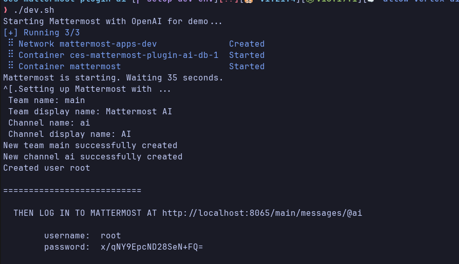
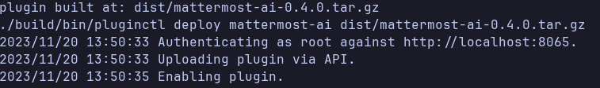
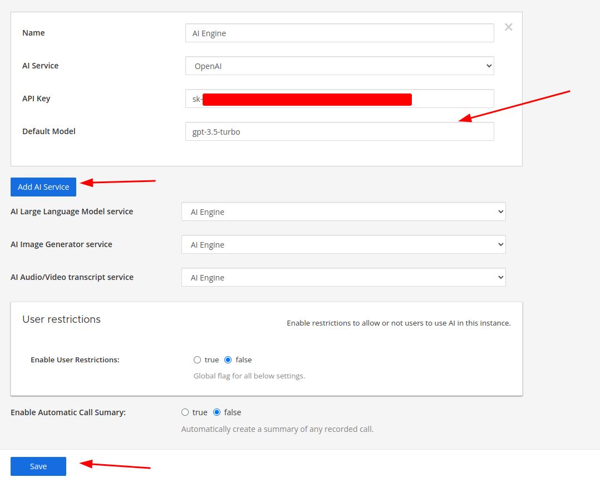
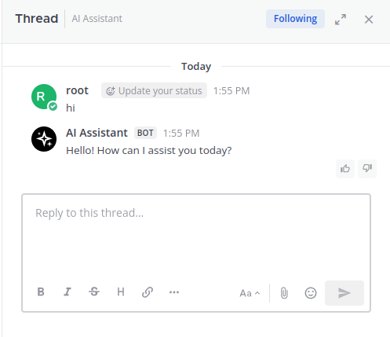

# Code Engine StudioMattermost AI Plugin
This is forked project from the [Original Mattermost AI Plugin](https://github.com/mattermost/mattermost-plugin-ai). We want to have a modified version of the original AI with additional features such as context from WIKI pages

# Prerequisites
- [Go](https://go.dev/doc/install)
- [NodeJS](https://nodejs.org/en/)
- [Docker & Docker Compose](https://docs.docker.com/get-docker/)
- [OpenAI Key](https://platform.openai.com/api-keys)

# How to start development environment
1. From top level of the project
2. Run `./dev.sh`
3. Navigate to `https://localhost:8065` with username and password from the terminal when running script at step 2
  
4. make
5. make deploy
6. MM_SERVICESETTINGS_SITEURL=http://localhost:8065 MM_ADMIN_USERNAME=root MM_ADMIN_PASSWORD='<PASSWORD_FROM_THE_TERMINAL>' make deploy

7. Go to `http://localhost:8065/admin_console/plugins/plugin_mattermost-ai` and click `Add AI Service`
8. Add API Key and Default Modal (gpt-3.5-turbo) and save

9. Chat with `@ai` \

# Additional Resources

- [Original Mattermost AI Plugin](https://github.com/mattermost/mattermost-plugin-ai)
- [Mattermost openops](https://github.com/mattermost/openops)
- [Mattermost Plugin Docs](https://developers.mattermost.com/integrate/plugins/)
- [OpenAI API]()
