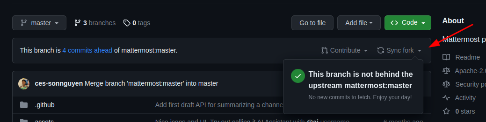

# Code Engine StudioMattermost AI Plugin

This is forked project from the [Original Mattermost AI Plugin](https://github.com/mattermost/mattermost-plugin-ai). We want to have a modified version of the original AI with additional features such as context from WIKI pages

# Prerequisites

-   [Go](https://go.dev/doc/install)
-   [NodeJS](https://nodejs.org/en/)
-   [Docker & Docker Compose](https://docs.docker.com/get-docker/)
-   [OpenAI Key](https://platform.openai.com/api-keys)

# How to start development environment

1. From top level of the project
2. Run `./dev.sh`
3. Seed data and embeddings to the Qdrant database. More details can be found here: [ces-mattermost-ai-embeddings](https://github.com/Code-Engine-Studio/ces-mattermost-ai-embeddings)
4. Navigate to `https://localhost:8065` with username and password from the terminal when running script at step 2
   
5. MM_SERVICESETTINGS_SITEURL=http://localhost:8065 MM_ADMIN_USERNAME=root MM_ADMIN_PASSWORD=super_secret_password make deploy
   
6. Go to `http://localhost:8065/admin_console/plugins/plugin_mattermost-ai` and click `Add AI Service`
7. Add API Key and Default Modal (gpt-3.5-turbo) and save
   
8. Chat with `@ai` \
   
9. To uninstall, run `./clean-dev.sh`

# How to stay update with the upstream repo

This is a forked repo from Mattermost AI plugin. We will try to have minimum change on the core functions of Mattermost AI plugin. We can use the `Sync fork` feature from Github to synchronize with the upstream repository. \

If there was a merge conflicts, follow these steps and resolve merge conflicts in your editor:

-   `git fetch upstream`
-   `git merge upstream/master`
-   Resolve merge conflicts
-   `git add .`
-   `git commit -m "<put-some-messages-here>"` //Follow the commit styles
-   `git push origin master`

# Additional Resources

-   [Original Mattermost AI Plugin](https://github.com/mattermost/mattermost-plugin-ai)
-   [Mattermost openops](https://github.com/mattermost/openops)
-   [Mattermost Plugin Docs](https://developers.mattermost.com/integrate/plugins/)
-   [OpenAI API](https://platform.openai.com/docs/overview)
